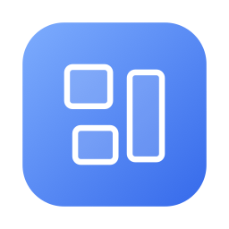

<div align="center">



# WindowSnap

**记住现在这堆窗口摆在哪，之后一键摆回去。**

macOS 菜单栏小工具。灵感来自已经下架的 [Stay](https://en.wikipedia.org/wiki/Stay_(software)) ——
官网打不开、App Store 也搜不到了，于是用系统公开 API 重新实现了一个。

[](https://github.com/Skyearn/WindowSnap/actions/workflows/ci.yml)
[](https://github.com/Skyearn/WindowSnap/releases)
[](https://www.apple.com/macos/)
[](https://swift.org)
[](LICENSE)

</div>

---

## 这是什么

你有没有过这种时刻：

- 笔记本接上外接屏，窗口全乱了，得一个个拖回去
- 白天用「工作」的一套窗口，晚上想切成「看片」的一套
- 手滑把窗口全拖散了，想回到刚才那个布局

WindowSnap 就是干这个的：把当前所有窗口的位置、尺寸、所在显示器、前后叠放顺序
存成一个「布局」，之后一键还原。

```
菜单栏点一下 → Safari 靠左、Xcode 铺满主屏、终端摞在最右下角
```

## 功能

| 能力 | 说明 |
| --- | --- |
| 保存布局 | 记录所有窗口的 位置 / 尺寸 / 显示器 / 最小化状态 / 前后顺序 |
| 一键恢复 | 点菜单或按快捷键；应用没开会自动帮你打开 |
| 三种保存粒度 | 保存**当前窗口** / **部分窗口**（勾选）/ **所有窗口**，都能存成新布局或覆盖已有布局 |
| 布局可编辑 | 按应用分组列出窗口，能删掉整个应用、删掉单个窗口、改坐标、停用、调顺序 |
| 跨显示器投影 | 换显示器、改分辨率、拔插外接屏后，窗口按**相对比例**投到新屏幕上 |
| 自动恢复 | 显示器配置变化 / 合盖唤醒 / 指定应用启动时，自动恢复某个布局 |
| 全局快捷键 | 四个功能 + 每个布局都能单独录快捷键，默认只给「恢复布局」配 `⌃Z` |
| 菜单栏状态图标 | 用图标变化表示 处理中 / 成功 / 警告 / 失败 / 缺权限，不占菜单栏空间 |
| 忽略指定应用 | 从正在运行的应用里点选，或去「应用程序」文件夹挑，不用手输 Bundle ID |
| 命令行模式 | `--scan` / `--save` / `--restore` / `--doctor` / `--selftest`，方便脚本化和排查 |
| 导入导出 | 布局存成可读 JSON，可备份、可迁移 |

## 安装

### 下载安装（推荐）

1. 到 [Releases](https://github.com/Skyearn/WindowSnap/releases) 下载 `WindowSnap-x.y.z.dmg`
2. 打开 dmg，把 WindowSnap 拖进「应用程序」
3. **第一次打开**：在「应用程序」里右键 → **打开** → 再点一次「打开」

   如果直接双击被拦下来，也可以在终端里执行一次：

   ```bash
   xattr -dr com.apple.quarantine /Applications/WindowSnap.app
   ```

   > 原因：这个 App 没有 Apple 开发者账号的公证签名（公证要 99 美元/年）。
   > 代码本身是公开的，你完全可以按下面「自己编译」一节自己构建一份。

4. **授权辅助功能**：系统设置 → 隐私与安全性 → 辅助功能 → 勾选 WindowSnap
   （列表里没有就点 `+` 手动添加 `/Applications/WindowSnap.app`）
5. **重启 WindowSnap** —— 授权之后必须重启进程才生效

### 自己编译

需要 Xcode 15+ / macOS 13+：

```bash
git clone https://github.com/Skyearn/WindowSnap.git
cd WindowSnap

# 编译 + 打包成 build/WindowSnap.app
./scripts/build.sh

# 顺便装进「应用程序」（开机自启需要 App 在固定位置）
./scripts/build.sh release install
```

想用 Xcode 改代码：`open Package.swift` 即可（SwiftPM 工程，不需要 `.xcodeproj`）。

## 快速上手

### 1. 存一个布局

把窗口摆成想要的样子 → 菜单栏图标 → **保存所有窗口布局** → **新建布局…** → 起个名字（比如「工作」）。

只想存一个窗口就用 **保存当前窗口布局**（存你正在用的那个），想挑几个就用 **保存部分窗口布局**。

三个选项的展开菜单结构一样：先列已有布局，「新建布局…」在最下面。

```
保存所有窗口布局 ▸
    工作              ← 点它 = 用当前所有窗口覆盖「工作」
    看片
    ─────────────
    新建布局…
```

### 2. 恢复

- 按 `⌃Z`（默认快捷键）恢复最近用过的布局
- 或者菜单栏图标 → **恢复布局** → 展开的列表里挑一个
- 每个布局还能单独绑一个快捷键（设置 → 快捷键）

### 3. 改布局

菜单栏 → **管理布局** → 选布局 → **编辑布局…**，会直接打开设置并选中它。

窗口列表是按应用分组的：

- **删除本应用**：一次把这个应用在布局里的记录全删掉（只删记录，不动真实窗口）
- 每条窗口右边：`↩︎` 只归位这一个窗口 / `⇄` 用当前窗口位置覆盖这条记录 / `✎` 编辑 / `↑↓` 调顺序 / `🗑` 删除
- 应用名左边和标题栏左边都有**三态复选框**（全勾 / 半勾 / 全不勾），一次开关整个应用或整个布局

### 4. 笔记本外接屏（最实用的场景）

1. 接上外接屏，把窗口摆好 → 存成「办公」
2. 设置 → 通用 → 打开 **显示器配置变化时自动恢复**，选用「办公」
3. 以后插上显示器窗口自己就位，合盖唤醒也会自动恢复

### 5. 触发应用

在「设置 → 布局」里给某个布局指定触发应用：这些应用一启动就自动恢复该布局。
（恢复过程中被自动拉起来的应用不会再次触发，不会死循环。）

## 菜单结构

```
WindowSnap
上次：已恢复 22 个窗口
────────────────────────
恢复布局 ▸                    ⌃Z
    工作
    看片
────────────────────────
保存当前窗口布局 ▸
保存部分窗口布局 ▸
保存所有窗口布局 ▸
────────────────────────
管理布局 ▸
    工作 ▸  编辑布局… / 更新布局 / 重命名… / 复制一份 / 删除…
────────────────────────
设置…                          ⌘,
打开日志文件夹
────────────────────────
退出 WindowSnap                ⌘Q
```

## 快捷键

设置 → **快捷键**，所有快捷键都在这一个页面里录：

| 功能 | 默认 |
| --- | --- |
| 恢复布局 | **⌃Z** |
| 保存当前窗口布局 | 不设置 |
| 保存部分窗口布局 | 不设置 |
| 保存所有窗口布局 | 不设置 |
| 每个布局（单独） | 不设置 |

**怎么录**：点右边的按钮 → 按下想用的组合键（必须带 ⌘ / ⌃ / ⌥ / ⇧ 至少一个）。

- `Esc` 取消这次录制，`Delete` 清除已设置的快捷键
- 录制期间会**临时注销所有全局热键** —— 不然你按下去的组合键会立刻把原来绑的动作触发掉
- 同一个组合键只能绑一个功能，绑到新地方时会自动把旧地方的解绑
- 如果某组键被系统或其他 App 占用了，注册会失败并记在日志里

## 菜单栏图标状态

菜单栏里不写文字（会挤占别的 App 的位置），改成换图标：

| 图标 | 含义 |
| --- | --- |
| 窗口字形 | 就绪 |
| 沙漏 | 正在扫描 / 正在恢复 |
| 对勾 | 上一次操作成功（几秒后自动退回就绪） |
| 警告三角 | 有窗口没恢复成功、布局里没窗口之类的提示 |
| 叉 | 操作失败 |
| 手掌 | 还没拿到辅助功能权限（授权后会自动变回窗口字形） |

具体文字在点开菜单后的第一行（`上次：已恢复 22 个窗口`）。

## 命令行

```bash
APP=/Applications/WindowSnap.app/Contents/MacOS/WindowSnap

$APP --doctor              # 检查权限、显示器、功能快捷键、已保存布局
$APP --scan                # 列出当前所有窗口（位置尺寸显示器）
$APP --scan --json         # 同上，JSON 输出
$APP --save "家里"          # 把所有窗口存成布局
$APP --save-window 3 "看板"  # 只把 --scan 列表里第 3 个窗口存成布局
$APP --restore "家里"       # 恢复布局
$APP --list                # 列出已保存的布局
$APP --selftest            # 跑一遍内置自检（104 项断言）
```

`--selftest` 不需要辅助功能权限，可以随时验证代码是否正确 —— CI 里跑的就是它。

## 工作原理

- **读写窗口**：`AXUIElement`（`AXPosition` / `AXSize` / `AXMinimized` / `AXFullScreen`）。
  卡死的应用会把 AX 调用拖好几秒，所以统一把 `AXUIElementSetMessagingTimeout` 压到 1 秒。
- **坐标系**：AX 和 CGWindowList 用的是「主屏左上角为原点、y 向下」的全局坐标；
  `NSScreen` 用的是「左下角为原点、y 向上」。`ScreenGeometry` 负责互转。
- **跨屏投影**：布局里同时存绝对坐标和「相对显示器的归一化矩形」。
  同一块屏还在就用绝对坐标（最精确）；屏没了就用归一化坐标投影到新屏，再收进可见区域。
- **前后顺序**：从 `CGWindowListCopyWindowInfo` 的返回顺序取 z 序，
  恢复时按「从后往前」依次 `AXRaise`，还原原来的叠放关系。
- **窗口配对**：贪心匹配，打分 = 标题相似度 ×3 + 位置接近度 ×2 + 尺寸接近度 + 类型一致。
  分数太低就按顺序捡剩下的窗口，避免硬凑。
- **全局热键**：Carbon `RegisterEventHotKey`。相比 `NSEvent` 全局监听，
  它注册的是系统级热键，不需要「输入监控」权限，也不会吞掉别的按键。
- **图标**：菜单栏用系统符号 `rectangle.3.group`；App 图标是把这个符号渲染出来
  逐像素量出三块矩形的比例，再用 CoreGraphics 自己画的（SF Symbols 许可不允许直接用进 App 图标）。
  改图标：动 `scripts/make_icon.swift` 里的 `glyphRects`，然后

  ```bash
  swift scripts/make_icon.swift
  iconutil -c icns build/AppIcon.iconset -o Resources/AppIcon.icns
  ./scripts/build.sh release
  ```

## 数据文件

```
~/Library/Application Support/WindowSnap/layouts.json   布局
~/Library/Logs/WindowSnap/WindowSnap.log                日志
```

`layouts.json` 是给人看的，可以直接编辑、可以用 `--selftest` 里的导入导出功能备份。
同一份文件里每条窗口记录长这样：

```jsonc
{
  "bundleID": "com.apple.Safari",
  "title": "Apple",            // 保存时的窗口标题
  "matchTitle": null,          // 自定义匹配关键词，填了就以它为准
  "isEnabled": true,           // false = 留着记录但不参与恢复
  "frame": { "x": 0, "y": 25, "width": 960, "height": 900 },   // 全局坐标
  "displayFrame": { },         // 保存时那块显示器的矩形
  "relativeFrame": { },        // 相对显示器的归一化坐标（换屏靠它）
  "zIndex": 0                  // 前后顺序，0 在最前面
}
```

## 常见问题

**点了恢复但窗口没动**

先看菜单栏图标是不是手掌（没权限）。授权之后一定要**重启应用**。
Chromium / Electron 系应用（Chrome、VS Code、Slack…）请打开设置里的**兼容模式**。

**开机自启是灰的 / 提示不可用**

先把 App 放进 `/Applications`：`./scripts/build.sh release install`，
然后在 系统设置 → 通用 → 登录项 里确认。

**授权明明勾了，重新编译之后又要重新授权**

说明这次构建掉到了 ad-hoc 签名。检查 `security find-identity -v -p codesigning`
有没有可用证书，或者显式指定：`CODESIGN_IDENTITY="证书名" ./scripts/build.sh`。

**想看恢复的时候到底发生了什么**

菜单 → 打开日志文件夹，`WindowSnap.log` 里有每一步的细节。

## 已知限制

- **窗口不能跨「调度中心」空间搬运**。macOS 没有公开 API 能把窗口移到别的 Space
  （yabai 那类工具用的是私有接口 + 关 SIP）。WindowSnap 只恢复位置尺寸，
  窗口留在它原来的 Space 里。
- 保存时处于**全屏**的窗口默认不动，避免把你正在全屏用的窗口踢出来（设置里可改）。
- 少数应用（游戏、部分 Electron 应用、自带窗口管理器的应用）会拒绝脚本改窗口，
  日志里会记一条「移动窗口失败」，先试试兼容模式。
- 恢复是**按照布局的描述去摆放**，不会关闭布局里没有的窗口。

## 参与开发

```
Package.swift                     SwiftPM 清单（用 Xcode 直接 open 这个文件）
Resources/Info.plist              LSUIElement=true，菜单栏应用，无 Dock 图标
Resources/AppIcon.icns            图标
Sources/WindowSnap/
  main.swift                      入口：先看是不是命令行模式，否则进菜单栏模式
  App/
    AppDelegate.swift             生命周期、首次运行引导
    AppController.swift           大脑：菜单 / 热键 / 通知都收敛到这里
    StatusBarController.swift     菜单栏图标状态机 + 菜单
    CLI.swift                     命令行模式
    SelfTest.swift                不依赖权限的自检（104 项）
  Core/
    AX.swift                      Accessibility API 封装
    Models.swift                  Layout / WindowSnapshot / Frame / HotKeySpec
    WindowScanner.swift           扫描窗口，生成快照
    WindowMatcher.swift           快照和真实窗口的配对打分
    WindowRestorer.swift          恢复流程（兼容模式、叠放顺序）
    WindowLocator.swift           找回某条记录对应的真实窗口
    ScreenGeometry.swift          坐标系换算、显示器解析、投影收敛
    AppLauncher.swift             拉起应用并等它交出窗口
    LayoutStore.swift             布局持久化与其他编辑操作
    AppSettings.swift             偏好设置
    AppActions.swift              四个全局动作
    HotKeyCenter.swift            Carbon 全局热键注册
    HotKeyKeys.swift              NSEvent ↔ Carbon 换算、键名表
    KeyCodes.swift                键码表
  UI/                             SwiftUI 界面（通用 / 布局 / 快捷键 / 关于）
scripts/build.sh                 编译 + 打包 + 签名
scripts/package.sh               出 zip + dmg
scripts/make_icon.swift          画图标
```

跑测试：

```bash
swift build && ./build/WindowSnap.app/Contents/MacOS/WindowSnap --selftest
```

## 发布流程

打 tag 就会自动出包并建 Release：

```bash
git tag v1.0.0
git push origin v1.0.0
```

`.github/workflows/release.yml` 会：编译通用二进制（arm64 + x86_64）→ 打 zip 和 dmg →
跑自检 → 生成 `SHA256SUMS.txt` → 发 Release。

想带上正规签名和公证，在仓库的 Secrets 里配这几项（不配就走 ad-hoc 签名，功能一样，只是首次打开要右键）：

| Secret | 说明 |
| --- | --- |
| `MACOS_CERT_P12` | Developer ID Application 证书导出的 `.p12`，base64 之后的文本 |
| `MACOS_CERT_PASSWORD` | 上面那个 p12 的密码 |
| `KEYCHAIN_PASSWORD` | 临时钥匙串的密码，随便设一个 |
| `APPLE_ID` | 公证用的 Apple ID |
| `APPLE_TEAM_ID` | Team ID |
| `APPLE_APP_PASSWORD` | App 专用密码 |

## License

[MIT](LICENSE)
